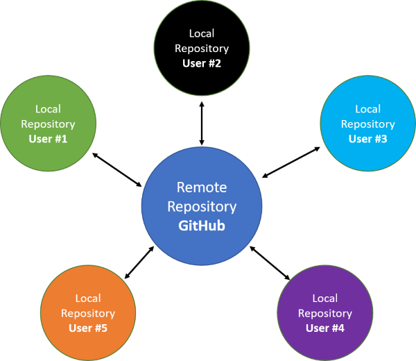

```{r setup, include=FALSE}
knitr::opts_chunk$set(echo = FALSE)
```

## Goal of Workshop

- Provide a basic overview of Git and GitHub
- Information on how to use these tools with data science projects
- Focus is from a beginner perspective

## Overview of Workshop

- What is Git and GitHub and why should I use them?
- Common Terminology
- Configuring Git
- Getting Started using Git and GitHub
  - Creating and Cloning Repositories
  - Committing, Pushing, and Pulling
  - General Workflows
- Collaborating with Others
  - Forking vs. Cloning
  - Adding Collaborators
  - Avoiding Merge Conflicts

## Git vs. GitHub {.build}

**Git** is a version control system originally used by software developers to work together on large projects

**GitHub** is a web or cloud-hosting service for Git-based projects

## Why should I use it?

-	Version control and backup
-	Collaboration
-	Sharing and developing R packages

## Common Terms

>- Repository
>- Commit
>- Push
>- Pull
>- Fetch
>- Branch
>- Organization

## Common Terms | Local vs. Remote repositories {.build}

Local: Saved on your computer only

Remote: Versions of the project that are hosted somewhere other than your computer. Most common is GitHub.

## Local vs. Remote repositories {.centered}



# Git and GitHub Setup | Any issues with installation or setting up accounts?

## Configuring Git with your name and email

Using Git Bash:

`git config --global user.name 'Your Name'`\
`git config --global user.email 'yourname@domain.com'`\
Check configuration with `git config --global --list`

Using the [`usethis package`](https://usethis.r-lib.org/) in R:

```{r echo = TRUE, eval = FALSE}
usethis::use_git_config(user.name = "Your Name", user.email = "yourname@domain.com")
```

# Getting Started

## Creating and Cloning Repositories

## Commit and Push from Local Repository

## Commit in GitHub and Pull into Local Repository

## General Workflows | Creating Repositories

## General Workflows | Committing Changes

## General Workflows | Pushing and Pulling


# Collaborating with Others

## Cloning vs. Forking Repositories

## Adding Collaborators

## Avoiding Merge Conflicts

## Sources and Useful References

Some of the information in this presentation is from the [Happy Git and GitHub for the useR](https://happygitwithr.com/) web document

## Possible more advanced topics

- Branches
- Pull requests
- Merging branches
- Undoing changes


